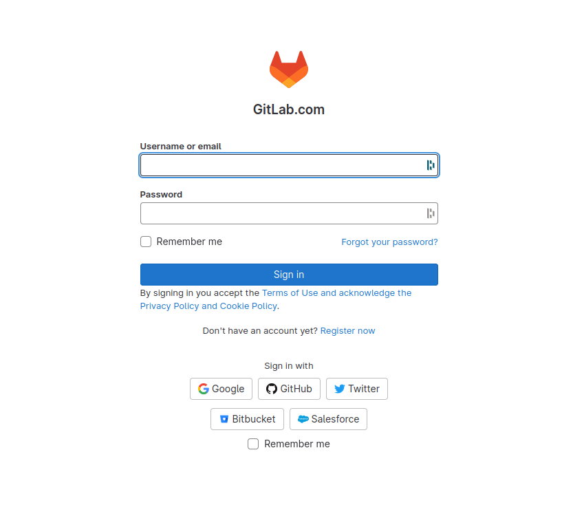
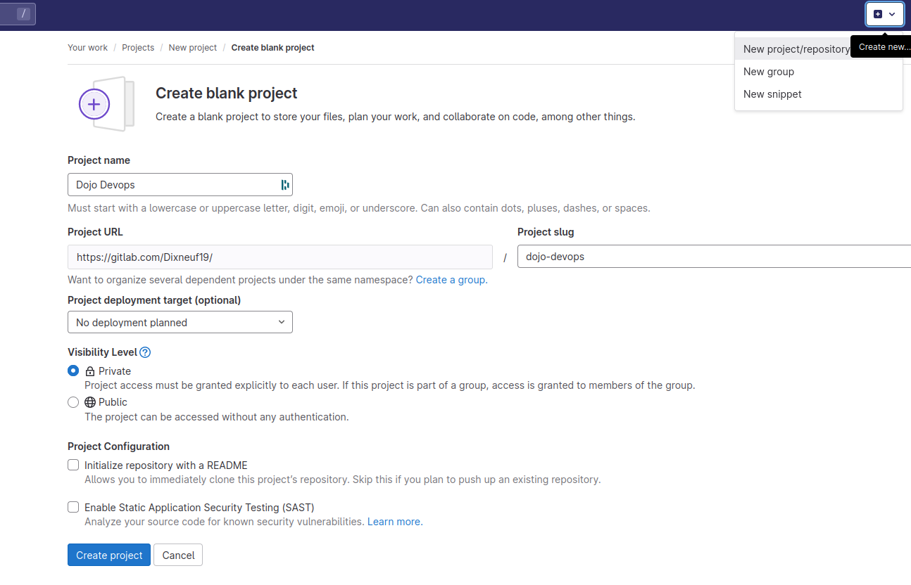

# Dojo SRE Padok

Welcome 🥳

# Dojo objectives

TL;DR: Learn how to deploy a web application on Kubernetes in AWS

Covered topics:
  - Infrastructure As Code
  - Infrastructure Deployment
  - Kubernetes
  - Build and deploy a web application in Kubernetes
  - Continous Integration & Continuous Delivery
  - High Availability of a web application in Kubernetes
  - Scaling of a web application in Kubernetes

This dojo is organised in several parts to cover all these subjects.

Since each of the topic could be a good choice for an entire Dojo, we will not deep dive. We will focus on basics and real working example. It's always satisfying to achieve things even if there is some "magics" part that we don't understand (for now!).

If you have any question, any issue or you want to know more about something, don't hesitate to ask!

For each exercise, there is a hint or the solution provided. First, try to do the exercise and find the solution by yourself. You can also ask to a member of Padok (and of course you can ask Google too). Don't get stuck on something and use the hint wisely.

# Part 0 - Initialization (~5-10 mins)

While this repo is hosted on Github, we will use Gitlab.com for the CI/CD part. So, we will push our code on Gitlab.com.

- [ ] Clone this repo

```bash
git clone https://github.com/padok-team/dojo-devops.git
```

- [ ] Connect to Gitlab.com with your account



- [ ] Create a new project Blank Project (don't check `Initialize repository with a README`)



- [ ] Push this repo into Gitlab. You'll need to add an SSH key or get an access token.

```bash
git remote rename origin github
git remote add origin https://gitlab.com/<your_repo>.git
git push -u origin --all
git push -u origin --tags
```

That's all for now, we will back later to Gitlab. You can move to the next part.

# Part 1. Amazon Web Service (~5 mins)

[Go to part 1](./01-AmazonWebService/README.md)

# Part 2. Infrastructure As Code (~30-45 mins)

[Go to part 2](./02-InfrastructureAsCode/README.md)

# Part 3. Kubernetes (~15 mins)

[Go to part 3](./03-Kubernetes/README.md)

# Part 4. Application (~30 mins)

[Go to part 4](./04-Application/README.md)

# Part 5. Play with Kubernetes (~20 mins)

[Go to part 5](./05-PlayWithKube/README.md)

# Part 6. Cleaning (~10 mins)

[Go to part 6](./06-Cleaning/README.md)
